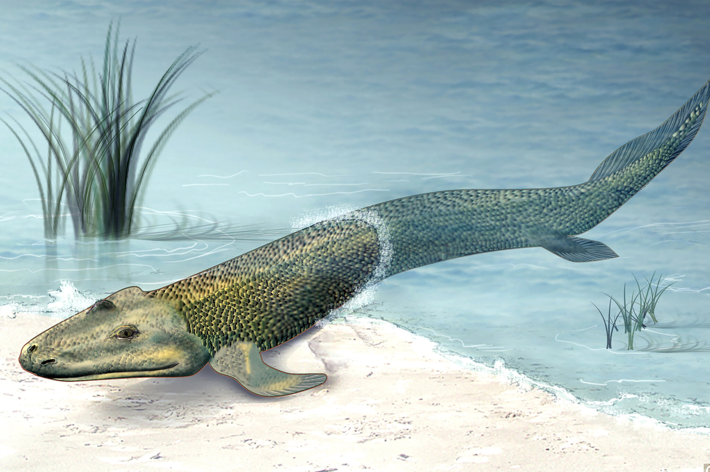

# Tiktaalik 🐟➡️🐊

Simulate the evolution of fish learning to walk on land powered by neural networks and genetic algorithms. Written in Rust and compiled into WebAssembly.

[Tiktaalik](https://en.wikipedia.org/wiki/Tiktaalik) is genus of extinct lobe-finned fish that lived around 375 million years ago. They are recognized as a transition form; containing characteristics of both fish and tetrapods. Believed to be the first fish to transition to living on land.

## Development

| Command | Description| 
| ------- | ---------- |
| `cargo test` | Run unit tests.|
| `cargo llvm-cov --open` | Run code coverage.|
